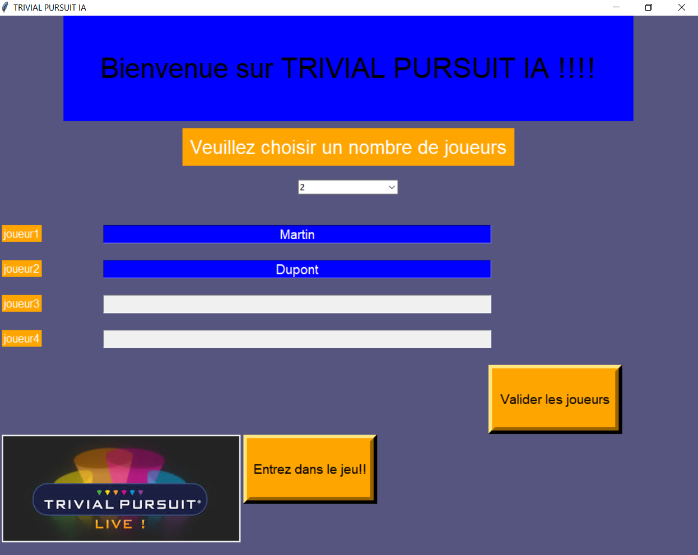
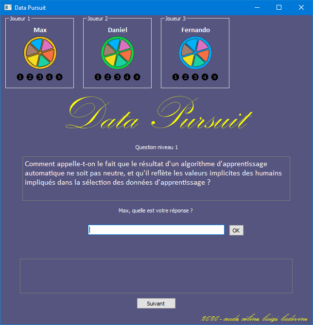
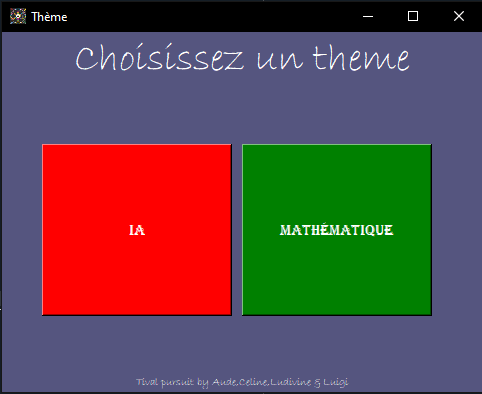
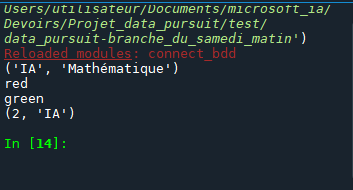
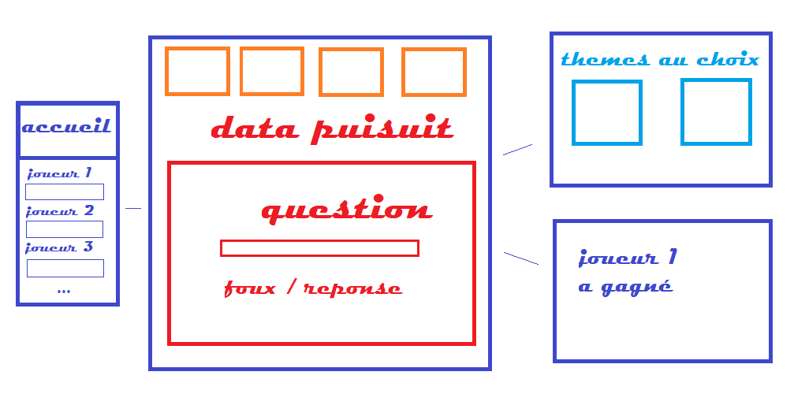
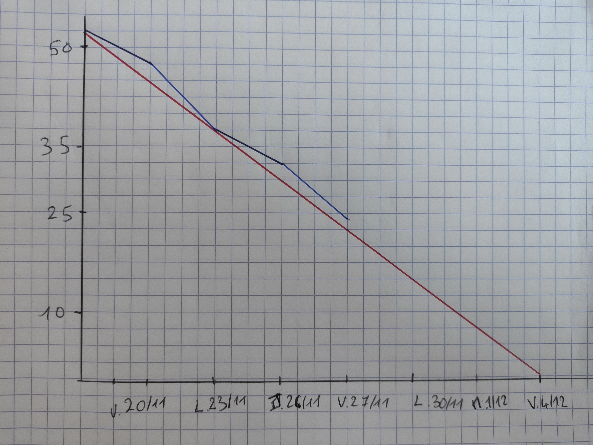

# TRIVIAL DATA

Ce projet Trivial Data a été créé par Aude, Luigi, Céline et Ludivine. 
Le résultat final sera époustouflant (ou presque) !

## Deuxième semaine

### Résultats graphiques

Page d'accueil :

Interface de jeu principale :

Choix aléatoire du thème :

## Première semaine
### Modèle logique des données

### Projet d'interface graphique 30 novembre

### Burndown du lundi 30 Novembre

