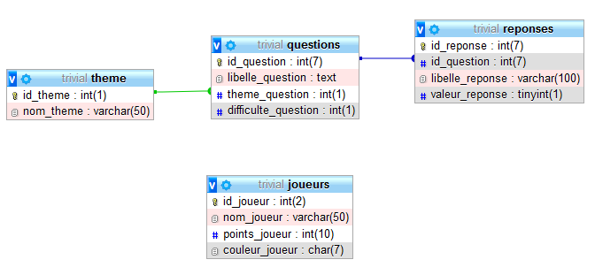

## Bonjour du samedi matin !
J'ai (ludivine) travaillé un peu sur le main. J'ai créé une "branche_du_samedi_matin" Pour que ça fonctionne, j'ai intégré vos parties dedans et je l'ai ai un peu modifiées (une toute petite modif pour la partie de Aude, rien de plus qu'hier pour celle de Luigi)
Je n'ai aps modifié vos fichiers : j'ai tavaillé uniquement dans le main (et maintenant j'ai la flemme), donc je vous laisse regarder ce que j'ai fait dans le main de la branche_du_samedi_matin, et les intégrer à vos fichiers (ou non) comme ça vous plairera... (Ca concerne uniquement Luigi et Aude, vu que pour l'instant il n'y a pas du tout d'interface...)
Pour l'instant, vous pouvez untiliser le fichier main pour faire tourner le programme, ça fonctionne jusque là où on en est, et c'est déjà pas mal !...

# TRIVIAL DATA

Ce projet Trivial Data a été créé par Aude, Luigi, Céline et Ludivine. 
Le résultat final sera époustouflant!

### Modèle logique des données

